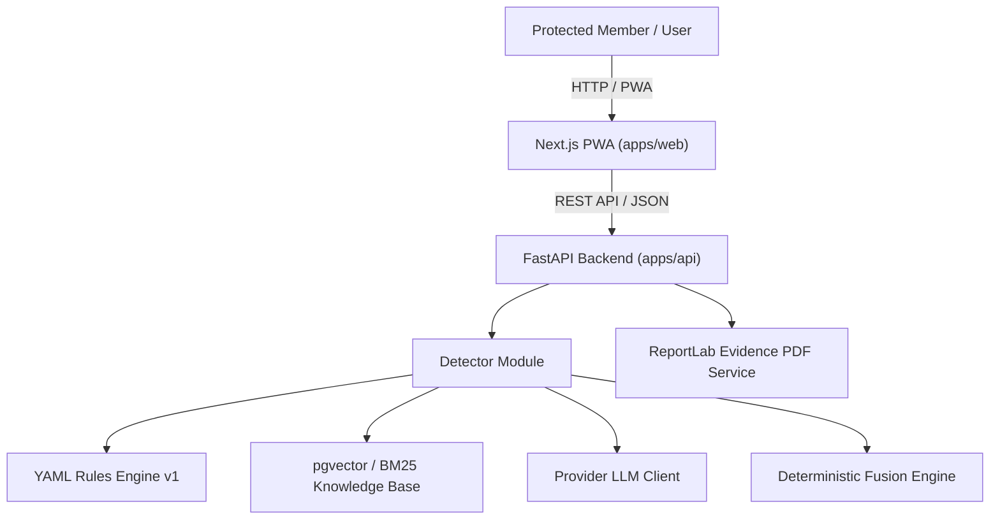
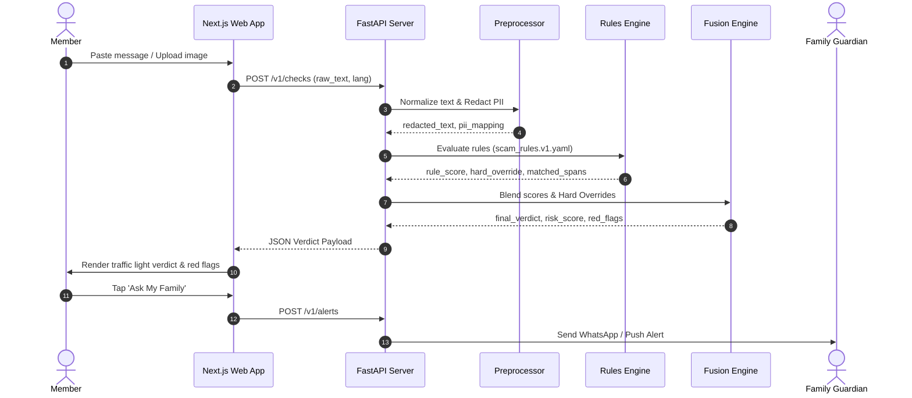

# System Architecture - Suraksha Parivar

## Overview
Suraksha Parivar is structured as a privacy-first monorepo combining a responsive Next.js PWA frontend and a Python FastAPI microservice engine.

## Sequence Diagram: Scam Check & Alert Flow

## Data Boundaries
- **PII Boundary**: Raw phone numbers, UPI IDs, Aadhaar numbers, and names are stripped before external processing.
- **Retention Purge**: Temporary check hashes auto-expire after 7 days; evidence packs are stored with application-level encryption and auto-purged after 90 days.
