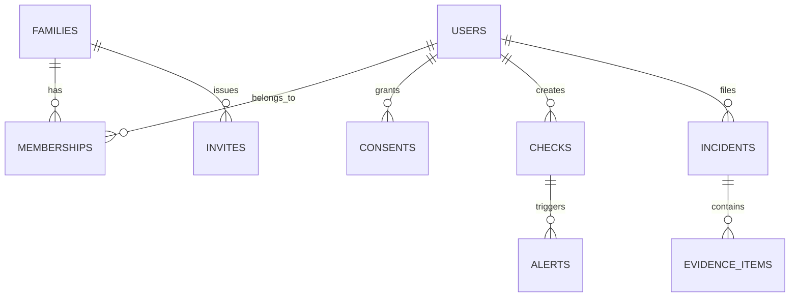

# Data Model & ERD - Suraksha Parivar

## Entity Relationship Diagram

## Schema Entities
1. **users**: `id`, `display_name`, `preferred_language`, `text_scale`, `created_at`
2. **families**: `id`, `name`, `created_by`, `created_at`
3. **memberships**: `id`, `family_id`, `user_id`, `role (member|guardian|both)`
4. **invites**: `id`, `family_id`, `token_hash`, `expires_at`
5. **consents**: `id`, `member_user_id`, `guardian_user_id`, `level (alert_only|redacted_summary|full_message)`
6. **checks**: `id`, `input_hash`, `language`, `verdict`, `risk_score`, `category`, `flags_json`, `expires_at`
7. **alerts**: `id`, `check_id`, `family_id`, `from_user_id`, `status (new|seen|confirmed_scam)`
8. **incidents**: `id`, `user_id`, `started_at`, `loss_types_json`, `amount`, `status`
9. **evidence_items**: `id`, `incident_id`, `kind`, `value_encrypted`
